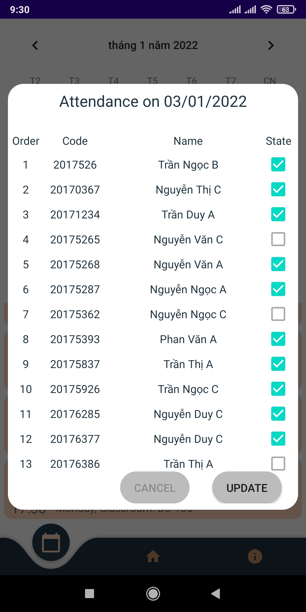

 **Table Of Contents** 
- [Introduction](#introduction)
- [Environment](#environment)
- [Usage](#usage)
  - [Login interface](#login-interface)
  - [Mainscreen interface](#mainscreen-interface)
    - [Interacting with classroom objects](#interacting-with-classroom-objects)
    - [Interacting with student objects](#interacting-with-student-objects)
  - [Notification interface](#notification-interface)
    - [Viewing classroom schedule](#viewing-classroom-schedule)
    - [Attending students](#attending-students)
  - [Home interface](#home-interface)
- [Contributors](#contributors)

# Introduction 
:notebook: This classroom management program will provide basic utilities to help teachers easily to manage students in their classes. This project is made for learning purposes. :man_student:  :woman_student:

# Environment
- We run this project on Android Studio IDE.
- Our virtual device that we used to debug the program in android studio is Pixel 5 (api: 26, resolution: 1080 x 2340: 440dpi, Target: Android 8.0, CPU/ABI: x86).
- Our physical device: Redme 5 pro
# Usage
## Login interface
- User can login by google account.
- If the user doesn't have an account before, click on "Create New Account" to signup account.

## Mainscreen interface
- After successfully logining, the main interface of the program will appear. Click on the bottom menu (includes notification item, home item, list of classrooms, about item) on the screen and select item connected with list of the unique user's classrooms (the third item from left to right of the bottom menu).
- About item contains the application's intro, the current version number, information of the account, signout button.

### Interacting with classroom objects
- If you want to add a new classroom, you will click on the ( + ) image button at the bottom-right, then a adding window to add a new classroom will appear, fill up with classroom's desired information and click "Save" to save the infor.
- If you want to update the class information, just long press on this classroom item in the list view, then an editing window will appear (for this classroom item). Hearin, You can update this classroom's information, delete the classroom by clicking the trash icon at the top-right corner of action bar (a dialog will pop up to confirm deleting).

### Interacting with student objects
- When clicking on a specific classroom in list view of classrooms, a list of students corresponding to this classroom will appear. The number of available students in the classroom will be displayed on the screen.

- If you want to add a student to the classroom, you will click on the ( + ) at the bottom-right, then a adding window to add a new classroom will appear, fill up with the student's desired information and click "Save" to save the infor.
- If you want to update student's information, just long press on this student item in the list view, then an editing window will appear (for this student item). Hearin, You can update or delete the same as above with the classroom's manual.
- Besides, you can also search for the student' name in the list in the class by clicking on the searching icon at the top of action bar.

## Notification interface
- This interface includes two functions: viewing classroom schedule and attendance in everyday, when user long press on a classroom item, an attendance window will appear (respectively attending on a day selected in calander).
### Viewing classroom schedule

### Attending students

## Home interface

# Contributors
This program was built by *Vu Duc Thai*, *Phan Thanh Tung*, *Vu Trong Toi* under the guidance of *Accociate Prof. Do Trong Tuan* using  java language, combining with some basic techniques of android. 
